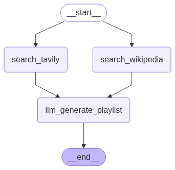

# ReadTune API


[](./LICENSE)

## 🎵 Read Tune API
 - This is an API with the purpose to create a Spotify Playlist optimized to be listened to during the reading of a book.
The project uses some techniques of Retrieval-Augmented Generation (RAG) to create the playlist.

## Where can I access this API?
 - The API is public available [here](https://cruel-juli-robot-book-playlist-a101d70b.koyeb.app/) If you'd like to know more or want to test the API in production, feel free to contact me here or via [Linkedin](https://www.linkedin.com/in/vin%C3%ADcius-jos%C3%A9-pierri-nogueira-341aa2175/)

## Which technologies were used?
 -  This project was built using:
    - LangChain 
        - Groq (llm's)
    - LangGraph
    - FastAPI 
    - Tavily (for retrieving documents about the selected book)
    - Google Books API
    - Spotify API
    - Poetry (dependencies management)
    - Authentication with Bearer token and OAuth2.0

## How does it work?
 - First you need to search for a book using the endpoint "/books/?query=?&max_result?" [example](./tests/controllers/test_books.py). Then you select the book and pass only the volume id in the url, and in the params you need to pass playlist_style(all available styles can be retrieved in the endpoint "/llm/style"),min_songs and max_song to the endpoint "/llm/{volume_id}" [example](./tests/controllers/test_llm.py).
 - The LLM process follow the image below:
    - The graph starts by searching info about the book using tavily and wikipedia at the same time
    - Then with the results from the search, info coming from google books, the chosen style and minimum and maximum songs, the LLM will generate an optimized playlist
    - The generated playlist will be created on spotify
    - The API will return the ID for the playlist on spotify and a link to open.spotify playlist
- All generated playlists follow this naming convention "Book Name - Authors - ISBN - Playlist Style"
- Every request need to be authenticated. The method used is OAuth2.0 with Bearer token
- You can acces the swagger on "/docs" endpoint




## How to run ?
- Since the code has control over users, you will need to  comment  the following lines in your first run. Without that you can't create new users.
    - File - [user.py](./app/controllers/user.py)
    - Method: create_user
    - Change the method as follow
    ```python
    
        @router.post(
            "/user/",
            # dependencies=[
            #    Depends(get_current_active_user),
            #    Depends(check_admin),
            # ],
            tags=["user"],
        )
        def create_user(user: User, session: SessionDep) -> User:
            user.password = get_password_hash(user.password)
            session.add(user)
            session.commit()
            session.refresh(user)
    return user
    ```
- Duplicate the .env.sample to a new file  .env, and follow the instructions below to edit your .env
    - **PYTHONPATH**: the value must to be ".", these will help pytest import the app folder
    - **GROQ_API_KEY**: this is your Groq Key, create your account on [https://console.groq.com/keys](https://console.groq.com/keys)
    - **GROQ_MODEL**: the llm model used to execute the instructions, the code was developed using deepseek-r1-distill-llama-70b, you can choose any other model, but the quality of the return can be different from expected
    - **SPOTIFY_CLIENT_ID** & **SPOTIFY_CLIENT_SECRET**: the client ID and secret  of your spotify app, you will need to create an app at the spotify developers to get one, follow [this tutorial to crete yours](https://developer.spotify.com/documentation/web-api/concepts/apps) 
    - **SPOTIFY_REFRESH_TOKEN**: This variable can be blank on your first use, then you will need to open the endpoint "http://127.0.0.1:8000/spotify/login/" on your browser, then login in your Spotify account, and get the refresh token that will appear after the login
    - **REDIRECT_URI**: the redirect URL for spotify callback, the default values is http://127.0.0.1:8000/spotify/callback/, this value should be used only during the local use, you need to put this URL on "Redirect URIs" Spotify App
    - **ENVIRONMENT**:This variable defines if the spotify login will be enable or not, dev means it will be enabled
    - GOOGLE_API_KEY: your google books api key, you can learn how to get one [here](https://developers.google.com/books/docs/v1/using?hl=pt-br#APIKey)
    - **TAVILY_API_KEY**: your tavily api key, this is needed to search on internet info about the chosen book. Create your account and get your Tavily key [here](https://auth0.com/signup?place=header&type=button&text=sign%20up)
    - **SECRET_KEY** = this is a secret key used to cryptography the users passwords before save on db and to compare with saved password, to generate one, run the following command on your cli, and put this value in your .env
        ```bash
        openssl rand -hex 32
        ```
    - **ALGORITHM**: the algorithm used to encode the JWT token, the default value is HS256
    - **ACCESS_TOKEN_EXPIRE_MINUTES**: the time in minutes for token be valid
    - **SQL_URL**: URL to connect to a SQL database, the default value is sqlite:///database.db, this default URL will connect to SQLite database.
    - **EMAIL_ADMIN** & **PWD_ADMIN** & **EMAIL_CLIENT** & **PWD_CLIENT**: those variables are only needed for tests purposes, so if will not execute the tests, you don't need to set this varibles, else put the admin email and password and client email and password values

- **Install dependencies:**
    - You can run like any other FastAPI Application, but firstly install poetry, on your cli:
        ```bash
        pip install poetry
        ```
    - Then, inside the folder where you downloaded this project, run:
        ```bash  
        poetry install
        ```
        This command will create a virtual environment and install all dependencies required to run.
    - Start the server:
        ```bash  
         poetry run uvicorn app.main:app --host 0.0.0.0 --port 8000 --reload
        ```
    - Open this link on your browser[API Documentation](http://127.0.0.1:8000/docs)
    - For more information on how to use Poetry please visit this [link](https://python-poetry.org/docs/basic-usage/).

## Running in docker
 - First build the Docker image:
    ```bash
    docker build --pull --rm -f "Dockerfile" -t read_tune_api:latest "."
    ```
    - Run the container:
    ```bash
    docker run -dti -p 8000:8000 --env-file .env  --name read_tune_api_image read_tune_api 
    ```
    - Open this link on your browser[API Documentation](http://127.0.0.1:8000/docs)

## 📄 License
- This project is licensed under the [Apache 2.0 License](./LICENSE).